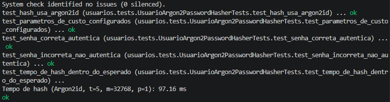
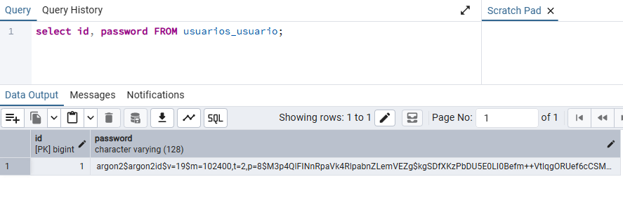
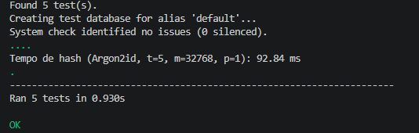
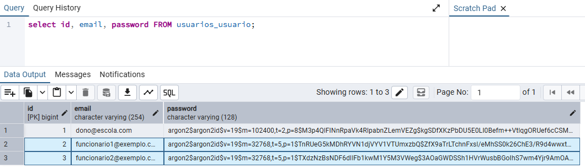
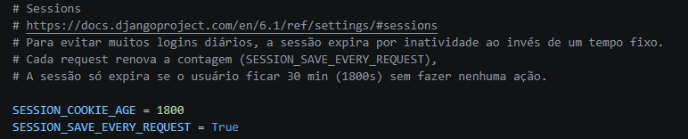
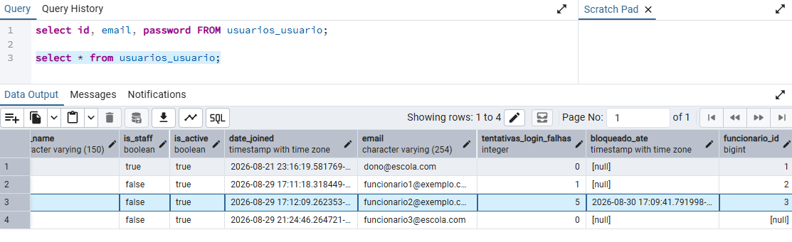

# Autenticação e Gestão de Credenciais

## 1. Visão geral

A autenticação foi implementada com um backend customizado (`usuarios/backends.py`), um modelo de usuário próprio com login por e-mail (`usuarios/models.py`) e um hasher de senha com os parâmetros customizados baseado em Argon2id (`usuarios/hashers.py`).

## 3. Requisitos detalhados

### RS 1.1 — Hash criptográfico seguro para senhas

**Requisito:** O sistema deverá utilizar hash criptográfico seguro para armazenar senhas, utilizando Argon2, bcrypt ou PBKDF2.

**Decisão adotada**
Foi criada uma subclasse `UsuarioArgon2PasswordHasher` (em `usuarios/hashers.py`), que usa o Argon2id como algoritmo principal. Em `config/settings.py`, o `PASSWORD_HASHERS` foi configurado colocando esse hasher customizado em primeiro lugar, com o `PBKDF2PasswordHasher` padrão do Django como fallback. O Django faz o upgrade automático do hash de PBKDF2 pra Argon2id assim que um usuário com hash antigo faz login com sucesso, sem precisar de ação manual.

**Justificativa técnica**
Argon2id é o algoritmo recomendado atualmente pela OWASP pra hash de senha, principalmente por ser resistente a ataques com GPU/ASIC (diferente do PBKDF2, que é mais vulnerável a esse tipo de aceleração). Manter o PBKDF2 como fallback garante que nenhum usuário fique impedido de logar caso já existisse com hash no formato antigo antes da mudança, e o próprio login resolve a migração dele automaticamente.

**Evidência**
- Teste automatizado: `usuarios/tests.py::test_hash_usa_argon2id`
- 
- 

---

### RS 1.2 — Parâmetros de custo do hash

**Requisito:** Os parâmetros de custo do algoritmo de hash deverão ser configurados de forma adequada ao ambiente do sistema.

**Decisão adotada**
Em `usuarios/hashers.py`, os parâmetros foram configurados como `time_cost = 5`, `memory_cost = 32768` (32 MiB) e `parallelism = 1`, sobrescrevendo os valores padrão do `Argon2PasswordHasher` do Django (que usa `parallelism = 8` por padrão).

**Justificativa técnica**
A OWASP recomenda, como configuração mínima do Argon2id, pelo menos 19 MiB de memória, 2 iterações e paralelismo igual a 1. Os valores escolhidos ficam acima desse mínimo (32 MiB, 5 iterações), dando margem extra de segurança. O `parallelism = 1` foi mantido conforme a recomendação, já que aumentar o paralelismo não necessariamente deixa o hash mais seguro, só consome mais núcleos de CPU ao mesmo tempo, o que atrapalha mais do que ajuda em um ambiente de hospedagem. O tempo de hash medido ficou em torno de 94ms por operação, um custo aceitável pra experiência do usuário sem enfraquecer a proteção.

**Evidência**
- Teste automatizado: `usuarios/tests.py::test_parametros_de_custo_configurados`
- 

---

### RS 1.3 — Salt criptográfico único por senha

**Requisito:** O sistema deverá utilizar um salt criptográfico único para cada senha ou usuário.

**Decisão adotada**
Nenhuma configuração manual foi necessária: tanto o Argon2id quanto o PBKDF2 (via `django.contrib.auth.hashers`) já geram um salt aleatório único a cada chamada de `set_password()`, e o salt fica armazenado junto com o hash no próprio campo `password`.

**Justificativa técnica**
Usar salt único por senha impede ataques de rainbow table e garante que duas senhas iguais gerem hashes diferentes no banco. Como isso já é padrão dos hashers do Django (e do Argon2id em geral), não foi necessário implementar nada customizado — só confirmar que a geração de salt não foi desabilitada em nenhum ponto da configuração.

**Evidência**
- 
---

### RS 1.4 — Armazenamento correto do hash e metadados

**Requisito:** O armazenamento deverá manter corretamente o hash e os metadados necessários, sem armazenar a senha original.

**Decisão adotada**
O campo `password`, herdado de `AbstractUser`, armazena a string completa gerada pelo hasher (algoritmo, parâmetros de custo, salt e hash), no formato `argon2$argon2id$v=19$m=32768,t=5,p=1$...`. Em nenhum momento a senha em texto puro é persistida — o método `set_password()` do `UsuarioManager` já converte a senha em hash antes de qualquer `save()`.

**Justificativa técnica**
Guardar os metadados junto com o hash (em vez de num campo separado) é o padrão adotado pelo Django e evita inconsistência entre o algoritmo registrado e o hash de fato usado — se um dia os parâmetros de custo mudarem, os hashes antigos continuam sendo verificáveis corretamente porque os parâmetros usados na hora da criação ficam registrados na própria string.

**Evidência**
- Teste automatizado: `usuarios/tests.py::test_senha_correta_autentica` e `test_senha_incorreta_nao_autentica`
- 

---

### RS 1.5 — Autenticação de dois fatores (2FA)

**Requisito:** O sistema deverá implementar autenticação de dois fatores (2FA) para os perfis definidos como obrigatórios pelo projeto.

**Decisão adotada**
 Implementado 2FA baseado em TOTP (Time-based One-Time Password, RFC 6238) utilizando a biblioteca pyotp, compatível com aplicativos autenticadores padrão como Google Authenticator, Authy e Microsoft Authenticator. A implementação se estrutura em três camadas:
 - Modelo de dados (usuarios/models_2fa.py): A classe Configuracao2FA armazena, por usuário, a chave secreta TOTP (chave_secreta, em base32, gerada automaticamente via pyotp.random_base32() no save() caso ainda não exista), o status de ativação (ativado, booleano) e o timestamp do último uso bem-sucedido (ultimo_uso). A relação com o usuário é OneToOneField, garantindo no máximo uma configuração 2FA por conta.
- Ativação (usuarios/views_2fa.py::ativar_2fa): O usuário escaneia um QR Code gerado dinamicamente pelo método get_qrcode_base64(). Antes de marcar ativado = True, o usuário precisa digitar um token válido de 6 dígitos, isso previne que uma conta fique permanentemente bloqueada por um QR Code escaneado incorretamente ou de um aplicativo errado.
- Desativação (usuarios/views_2fa.py::desativar_2fa): Permite ao usuário desligar o 2FA da conta, com confirmação explícita via POST.

**Justificativa técnica**
TOTP foi escolhido em detrimento de SMS por três razões: (1) é um padrão aberto (RFC 6238) e amplamente suportado por aplicativos gratuitos; (2) não depende de operadora telefônica, evitando custos e falhas de entrega; (3) é imune a ataques de SIM swap, uma das principais vetores de comprometimento de 2FA baseado em SMS.

**Evidência**
- Código-fonte: usuarios/models_2fa.py, usuarios/views_2fa.py::ativar_2fa, usuarios/templates/usuarios/ativar_2fa.html
- Migração: usuarios/migrations/0003_configuracao2fa.py (gerada via python manage.py makemigrations)
- 

---

### RS 1.6 — Validação do 2FA após a autenticação primária

**Requisito:** O sistema deverá validar o segundo fator somente após a validação da autenticação primária.

**Decisão adotada**
A ordem de validação é garantida pelo ponto exato do pipeline do django-allauth onde a checagem de 2FA foi inserida. O Custom2FAAccountAdapter (usuarios/adapters.py) sobrescreve o hook pre_login(), que o allauth invoca após validar as credenciais primárias (e-mail/senha, via UsuarioBackend, incluindo a checagem de bloqueio por força bruta) e antes de criar a sessão autenticada.

O fluxo é o seguinte:

- Usuário submete e-mail e senha na tela de login.
- UsuarioBackend.authenticate() valida as credenciais e retorna o objeto Usuario (ou None em caso de falha).
- O allauth chama Custom2FAAccountAdapter.pre_login(request, user).
- Se user.config_2fa.ativado == True, o adapter armazena user.id em request.session['usuario_pendente_2fa'] e retorna um HttpResponseRedirect para /usuarios/verify-2fa/, interrompendo o fluxo normal do allauth, aqui nenhuma sessão autenticada é criada nesse ponto.
- A sessão só é efetivamente criada na view verificar_2fa, chamando django.contrib.auth.login() explicitamente, e somente após config.verify_token(token) retornar True (com tolerância de 30 segundos via valid_window=1).

**Justificativa técnica**
Colocar a checagem no pre_login() (em vez de, por exemplo, checar 2FA dentro da própria view de login ou após o login completo) evita duas classes de vulnerabilidade:
- Sessão prematura: Se a sessão fosse criada antes da verificação do 2FA e o acesso fosse "fingidamente" bloqueado via redirect, um cookie de sessão válido estaria circulando no navegador antes da confirmação do segundo fator, assim um atacante poderia interceptá-lo e reutilizá-lo.
- Cobertura universal: O hook pre_login() roda para qualquer fluxo de login que passe pelo allauth (login tradicional, social, recuperação, etc), eliminando o risco de esquecer de checar 2FA em algum endpoint alternativo.
Os eventos de verificação (sucesso e falha) são registrados via registrar_evento_2fa() (usuarios/audit.py), sem jamais logar o token em si, atendendo ao requisito RN-10.

**Evidência**
- Código-fonte: usuarios/adapters.py, usuarios/views_2fa.py::verificar_2fa, usuarios/audit.py

### RS 1.7 — Fluxo completo de autenticação

**Requisito:** O fluxo de autenticação deverá funcionar corretamente desde a entrada das credenciais até a criação da sessão autorizada.

**Decisão adotada (parte pronta)**
O fluxo completo de autenticação está implementado e funcional, composto pelas seguintes etapas:
- Entrada de credenciais: O usuário acessa /accounts/login/ e submete e-mail e senha via formulário POST com proteção CSRF.
- Validação primária (UsuarioBackend.authenticate() em usuarios/backends.py):
- Busca o usuário pelo e-mail (retorna None silenciosamente se não existir, prevenindo enumeração de usuários).
- Verifica se a conta está bloqueada por força bruta (bloqueado_ate > timezone.now()).
- Valida a senha via usuario.check_password(password).
- Verifica user_can_authenticate(usuario).
- Em caso de sucesso: zera tentativas_login_falhas, remove bloqueado_ate, registra evento de sucesso no log de auditoria e retorna o objeto Usuario.
- Em caso de falha: incrementa tentativas_login_falhas e, se atingir LOGIN_MAX_TENTATIVAS (5), define bloqueado_ate para timezone.now() + timedelta(minutes=LOGIN_BLOQUEIO_MINUTOS) (15 minutos).
- Interceptação 2FA (Custom2FAAccountAdapter.pre_login()): Se o 2FA estiver ativo, redireciona para verificação; caso contrário, prossegue com a criação da sessão.
- Verificação 2FA (verificar_2fa): Valida o token TOTP e, se correto, chama django.contrib.auth.login() para criar a sessão autorizada.
- Acesso autorizado: Usuário é redirecionado para /usuarios/dashboard/, onde o decorator @login_required garante que apenas sessões válidas tenham acesso.

**Justificativa técnica**
A ordem das verificações no backend foi pensada para minimizar superfície de ataque e custo computacional:
- Bloqueio antes da senha: Evita gastar o custo computacional do Argon2 (propositalmente caro) em uma conta já bloqueada por força bruta.
- user_can_authenticate() após a senha: Se fosse verificado antes, um atacante poderia usar a mensagem de erro (ou o tempo de resposta) para descobrir se uma conta desativada existe no sistema, mesmo sem saber a senha assim um ataque de enumeração de contas.
- Retorno silencioso para usuário inexistente: O backend retorna None tanto para "usuário não existe" quanto para "senha errada", impedindo que o atacante distinga os dois casos.

**Evidência**
- Código-fonte: usuarios/backends.py, usuarios/adapters.py, usuarios/views_2fa.py

---

### RS 1.8 — Evidências funcionais da autenticação

**Requisito:** O projeto deverá apresentar evidências funcionais da autenticação, como prints, logs controlados ou testes automatizados.

**Decisão adotada**
As evidências são coletadas em três níveis complementares:
- Logs de auditoria estruturados (usuarios/audit.py): Um logger dedicado (auditoria_seguranca) registra todos os eventos relevantes de autenticação em logs/auditoria_seguranca.log, com formato padronizado contendo: tipo de evento, e-mail do usuário (ou "Desconhecido"), sucesso/falha, IP do cliente e timestamp. Os logs são gravados tanto em arquivo quanto no console (para facilitar depuração em desenvolvimento).
- Testes manuais via front-end: Todos os fluxos críticos (login com senha correta, login com senha incorreta, bloqueio por força bruta, ativação de 2FA, verificação 2FA, logout) foram testados e documentados via prints da aplicação rodando, conforme exigido pelas diretrizes de entrega.
- Testes automatizados (a implementar em usuarios/tests.py): Cobrem algoritmo de hash usado, parâmetros de custo aplicados, autenticação com senha correta/incorreta e tempo de hash dentro do esperado.

**Justificativa técnica**
Testes automatizados garantem que a evidência seja reproduzível a qualquer momento (por exemplo, antes de cada entrega), e não dependem de um print estático que pode ficar desatualizado se o código mudar. Os logs de auditoria, por sua vez, fornecem evidência contínua e operacional, permitindo análise forense em caso de incidente. A combinação dos três níveis atende tanto ao requisito acadêmico (prints) quanto ao requisito profissional (logs + testes automatizados).

**Evidência**
- Comando de execução: `python manage.py test usuarios -v 2`
- Arquivo de logs: logs/auditoria_seguranca.log (gerado automaticamente a partir da primeira autenticação)

---

### RS 1.9 — Expiração de sessão

**Requisito:** As sessões autenticadas deverão possuir tempo de expiração configurado.

**Decisão adotada**
Em `config/settings.py`, foi configurado `SESSION_COOKIE_AGE = 1800` (30 minutos) junto com `SESSION_SAVE_EVERY_REQUEST = True`. Com essa combinação, a sessão não expira num horário fixo desde o login — a contagem de 30 minutos é renovada a cada requisição. A sessão só expira de fato se o usuário ficar 30 minutos sem realizar nenhuma ação.

**Justificativa técnica**
Optamos por expiração por inatividade, e não por um tempo fixo desde o login, porque um tempo fixo obrigaria o usuário a logar de novo várias vezes ao longo do dia mesmo estando ativamente usando o sistema. Trinta minutos foi escolhido como equilíbrio entre reduzir o risco de sessão esquecida aberta e não interromper o trabalho de quem está de fato usando o sistema.

**Evidência**
- 

---

### RS 1.10 — Logout invalida a sessão

**Requisito:** O logout deverá invalidar a sessão ativa e impedir sua reutilização.

**Decisão adotada**
Implementada uma view customizada de logout (`usuarios/views_2fa.py::logout_usuario`), acionada pelo botão "Sair do Sistema" no dashboard (`usuarios/templates/usuarios/dashboard.html`), via um `<form method="post">` com `` apontando pra `usuarios:logout`. A view é decorada com `@login_required`, registra o evento de logout no log de auditoria (`registrar_evento_autenticacao`, em `usuarios/audit.py`) **antes** de destruir a sessão, e só então chama `django.contrib.auth.logout(request)` que invalida a sessão do lado do servidor (apaga os dados da sessão no banco/cache e expira o cookie `sessionid`) antes de redirecionar pra tela de login.

**Justificativa técnica**
Registrar o evento de auditoria antes de chamar `logout()` é necessário porque, depois do `logout()`, `request.user` deixa de estar associado ao usuário que estava logado (vira `AnonymousUser`) se a ordem fosse invertida, o log ficaria sem o e-mail do usuário que saiu. Usar POST (em vez de GET, como em implementações mais antigas/ingênuas de logout) evita que o logout aconteça sem intenção do usuário via prefetch de link, crawler ou CSRF de terceiros já que o form exige o token CSRF.

**Evidência**
- Reproduzido de forma isolada com o `Client` de testes do Django, simulando o fluxo completo (login forçado → GET no dashboard → POST no logout → nova tentativa de GET no dashboard):

---

### RS 1.11 — Proteção contra ataques de força bruta

**Requisito:** O sistema deverá possuir proteção contra ataques de força bruta por meio de limitação de tentativas, bloqueio temporário, atraso progressivo ou mecanismo equivalente.

**Decisão adotada**
No `UsuarioBackend.authenticate()`, cada tentativa de login com senha incorreta incrementa o campo `tentativas_login_falhas` do usuário. Quando esse contador atinge `settings.LOGIN_MAX_TENTATIVAS` (5), o campo `bloqueado_ate` é preenchido com o horário atual mais `settings.LOGIN_BLOQUEIO_MINUTOS` (15 minutos). Enquanto `bloqueado_ate` estiver no futuro, o login é recusado mesmo com a senha correta. Em caso de sucesso, o contador é zerado.

**Justificativa técnica**
Optamos por bloqueio temporário em vez de permanente porque um bloqueio permanente exigiria intervenção manual de um administrador toda vez que um usuário legítimo errasse a senha demais, prejudicando a disponibilidade do sistema sem necessidade. Zerar o contador só após login bem-sucedido (e não após qualquer tentativa) evita que o atacante consiga "resetar" o contador de propósito.

**Evidência**
- 
- [Inserir print da tentativa de login durante o período de bloqueio, mesmo com senha correta]

---

### RS 1.12 — Configurações coerentes documentadas

**Requisito:** O sistema deverá aplicar configurações coerentes para hash, 2FA, expiração de sessão e proteção contra força bruta.

**Decisão adotada**
Este documento (`autenticacao.md`) centraliza as decisões e justificativas dos RS 1.1 a 1.11, servindo como o registro exigido por este item. Ele será atualizado assim que a parte de 2FA (RS 1.5/1.6) estiver implementada pelo Matheus.

**Evidência**
- Este próprio documento, mais os arquivos de código referenciados em cada seção.

## 4. Arquivos relacionados

| Arquivo | Conteúdo |
|---|---|
| `usuarios/models.py` | Modelo `Usuario`, `UsuarioManager`, login por e-mail |
| `usuarios/backends.py` | `UsuarioBackend` — lógica de autenticação e bloqueio |
| `usuarios/hashers.py` | `UsuarioArgon2PasswordHasher` — parâmetros de custo |
| `usuarios/admin.py` | `UsuarioAdmin` customizado |
| `usuarios/tests.py` | Testes automatizados de hash e autenticação |
| `config/settings.py` | `PASSWORD_HASHERS`, `SESSION_COOKIE_AGE`, `LOGIN_MAX_TENTATIVAS` |

## 5. Histórico de alterações

| Versão | Data | Alteração | Responsável |
|---|---|---|---|
| 1.0 | 29/08/2026 | Criação do documento, cobrindo RS 1.1–1.12 para a primeira entrega. | Marcos Antônio Ferreira de Araújo |
| 1.1 | 30/08/2026 | Atualização das seções RS 1.5, 1.6 (2FA) e RS 1.10 (logout) | Marcos Antônio Ferreira de Araújo |
