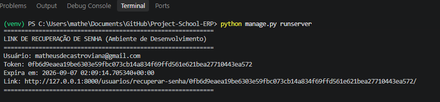
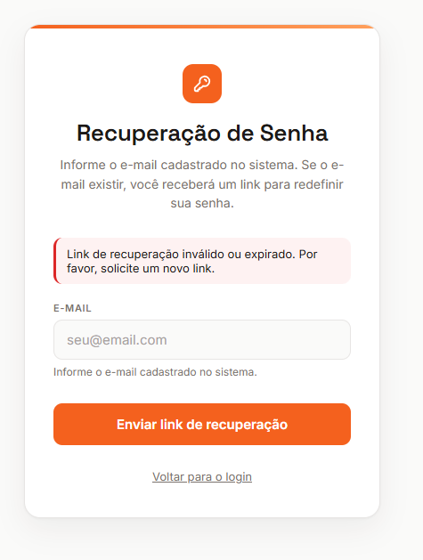
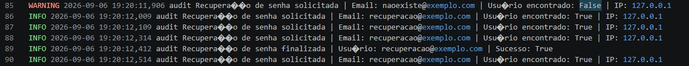

# Documentação — Recuperação de Senha (RS 2.1 a RS 2.5)

**Projeto:** ERP Escola Profissionalizante  
**Autores:** Marcos Antônio Ferreira de Araújo e Matheus de Castro Viana  
**Versão do Documento de Requisitos:** 1.1  
**Data da implementação:** 05 de setembro de 2026  
**Entrega:** Projeto Integrador - Recuperação de Senha  

---

## RS 2.1 — Funcionalidade de recuperação de senha

**Requisito:** O sistema deverá disponibilizar funcionalidade de recuperação de senha para usuários elegíveis.

### Decisão adotada

Implementado um fluxo completo de recuperação de senha independente do django-allauth, composto por três etapas:

1. **Solicitação** (/usuarios/recuperar-senha/): O usuário informa o e-mail cadastrado. Se o e-mail existir no sistema, um token criptográfico é gerado e o link de recuperação é enviado (em ambiente de desenvolvimento, exibido no console do servidor, em produção, será enviado por e-mail).

2. **Validação e redefinição** (/usuarios/recuperar-senha/<token>/): O usuário acessa o link recebido, que valida o token e apresenta um formulário para definição da nova senha.

3. **Confirmação**: Após a nova senha ser definida com sucesso, o token é invalidado e o usuário é redirecionado para a tela de login.

O fluxo foi implementado em arquivos dedicados para manter separação de responsabilidades:
- **usuarios/models_recuperacao.py:** Modelo TokenRecuperacaoSenha` que armazena os tokens.
- **usuarios/forms_recuperacao.py:** Formulários SolicitarRecuperacaoForm e NovaSenhaForm.
- **usuarios/views_recuperacao.py:** Views solicitar_recuperacao e confirmar_recuperacao.
- **usuarios/templates/usuarios/solicitar_recuperacao.html e confirmar_recuperacao.html:** Interfaces do usuário.
- **Link de acesso adicionado na tela de login (config/templates/account/login.html)** com o texto "Esqueceu a senha?".

### Justificativa técnica

Optamos por implementar um fluxo próprio em vez de utilizar o mecanismo de recuperação do django-allauth por dois motivos principais:

1. **Controle explícito sobre a expiração temporal do token**: O allauth utiliza um mecanismo baseado no timestamp do último login do usuário, o que não atende diretamente ao requisito RS 2.3 (tempo de expiração definido e explícito). Nossa implementação armazena o campo expira_em diretamente no banco, permitindo validação.

2. **Rastreabilidade e auditoria**: O modelo TokenRecuperacaoSenha registra metadados como ip_solicitacao, user_agent, criado_em e utilizado_em, atendendo aos requisitos de auditoria (RS 2.6 e RS 2.7) e permitindo análise em caso de incidente.

3. **Prevenção de enumeração de usuários**: A view de solicitação sempre retorna a mesma mensagem genérica ("Se o e-mail informado estiver cadastrado no sistema, você receberá um link..."), independentemente de o e-mail existir ou não no banco. Isso impede que um atacante mapeie quais e-mails estão cadastrados no sistema.

### Evidências

- **Arquivos**: usuarios/models_recuperacao.py, usuarios/forms_recuperacao.py, usuarios/views_recuperacao.py, config/templates/account/login.html
- **Print da tela de solicitação** : formulário com campo de e-mail e botão de envio
- **Print do terminal** : bloco destacado exibindo o link de recuperação gerado, contendo o token e o horário de expiração

---

## RS 2.2 — Token criptograficamente seguro

**Requisito:** O token de recuperação deverá ser gerado por mecanismo criptograficamente seguro e não previsível.

### Decisão adotada

O token é gerado no método save() do modelo TokenRecuperacaoSenha utilizando a combinação de duas técnicas:

1. **Geração de entropia**: secrets.token_urlsafe(64) com função da biblioteca padrão secrets do Python, que utiliza os.urandom() como fonte de entropia. Esta função é alimentada pelo gerador de números aleatórios do sistema operacional (CryptGenRandom no Windows), que é considerado criptograficamente seguro.

2. **Hash SHA-256**: A string aleatória de 64 caracteres é submetida ao algoritmo SHA-256 (hashlib.sha256), produzindo um token final de 64 caracteres hexadecimais. O hash é armazenado no banco em vez da string original.

O campo token possui unique=True e db_index=True no modelo, garantindo unicidade e eficiência de busca.

### Justificativa técnica

A combinação secrets + SHA-256 atende a três objetivos de segurança:

- Não previsibilidade: secrets.token_urlsafe() é projetado especificamente para geração de tokens seguros, em contraste com random (que é previsível). A entropia de 64 bytes (512 bits) antes do hash torna o espaço de busca impraticável para ataques de força bruta.
- Proteção em caso de comprometimento do banco: Mesmo que um atacante obtenha acesso de leitura ao banco de dados, ele verá apenas o hash SHA-256 do token, não o valor original. Como SHA-256 é uma função unidirecional, é computacionalmente inviável reverter o hash para obter a string original.
- Tamanho adequado: 64 caracteres hexadecimais (256 bits de entropia efetiva).

### Evidências

- **Arquivo:** usuarios/models_recuperacao.py (método save())
- **Print do terminal :** exemplo de token gerado com 64 caracteres hexadecimais
- **Inspeção do banco:** campo token da tabela usuarios_tokenrecuperacaosenha contendo apenas o hash, nunca a string original

## RS 2.3 - Token com tempo de expiração

**Requisito:** O token de recuperação deverá possuir tempo de expiração definido.

### Decisão adotada

O tempo de expiração é definido automaticamente no momento da criação do token, no método save().

O valor padrão de 24 horas foi escolhido como equilíbrio entre usabilidade (tempo suficiente para o usuário receber o e-mail e concluir o processo) e segurança (janela de ataque limitada).

A validação da expiração ocorre em dois pontos:

- Método is_valido() do modelo: Retorna False se expira_em < timezone.now() ou se o token já foi utilizado.
- View confirmar_recuperacao: Antes de permitir a redefinição da senha, chama token_obj.is_valido(). Se o token estiver expirado, o usuário é redirecionado para a tela de solicitação com uma mensagem genérica de erro.

Além disso, a tela de redefinição de senha exibe ao usuário o horário exato de expiração do token ({{ expira_em|date:"d/m/Y H:i" }}), aumentando a transparência.

### Justificativa técnica

O valor de 24 horas está alinhado com as recomendações do OWASP, que sugere janelas de expiração curtas (tipicamente entre 1 e 24 horas) para tokens de recuperação. Valores maiores aumentam o risco de um token interceptado ser utilizado por um atacante; valores menores prejudicam a usabilidade, especialmente se o e-mail demorar a chegar. A expiração é verificada no lado do servidor (não apenas no cliente), garantindo que mesmo que o usuário tente manipular o horário local ou reutilizar um link antigo, o token será rejeitado.

### Evidências

- **Arquivo:** usuarios/models_recuperacao.py (método save() e is_valido())
- **Configuração:** config/settings.py (TOKEN_RECUPERACAO_EXPIRACAO_HORAS = 24)
- **Print do terminal :** campo "Expira em" exibindo o timestamp de expiração
- **Print de token expirado :** mensagem genérica de erro ao tentar usar token fora do prazo

## RS 2.4 - Token invalidado após uso

**Requisito:** O token deverá ser invalidado imediatamente após o uso bem-sucedido.

### Decisão adotada

Após a nova senha ser definida com sucesso, o método marcar_como_utilizado() é chamado.

A validação de uso ocorre no método is_valido(), que retorna False se self.utilizado == True. Isso impede que o mesmo token seja reutilizado, mesmo que ainda esteja dentro do prazo de expiração. 

### Justificativa técnica

A invalidação imediata após o uso é uma prática essencial de segurança prevista na RN-09 ("Tokens de recuperação não poderão ser reutilizados após o uso ou após a expiração"). Sem essa proteção, um token interceptado (por exemplo, via log, e-mail comprometido ou histórico do navegador) poderia ser reutilizado por um atacante para redefinir a senha da vítima a qualquer momento dentro da janela de 24 horas. O registro do timestamp utilizado_em permite auditoria posterior: é possível identificar quando cada token foi consumido, o que auxilia na investigação de incidentes.

### Evidências

- **Arquivo:** usuarios/models_recuperacao.py (método marcar_como_utilizado())
- **View:** usuarios/views_recuperacao.py::confirmar_recuperacao (chamada após usuario.set_password())

## RS 2.5 — Falha correta para token expirado

**Requisito:** O sistema deverá falhar corretamente quando o token estiver expirado, inválido, alterado ou já utilizado, sem revelar informações sensíveis.

### Decisão adotada

A view confirmar_recuperacao trata todos os cenários de falha com a mesma mensagem genérica "Link de recuperação inválido ou expirado. Por favor, solicite um novo link." Os cenários cobertos são:

- Token inexistente no banco: URL malformada ou token nunca gerado.
- Token expirado: usuário demorou mais de 24 horas para usar o link.
- Token já utilizado: tentativa de reutilização após redefinição bem-sucedida.
- Token alterado/manipulado: URL modificada manualmente pelo usuário.

Em todos os casos, o usuário é redirecionado para /usuarios/recuperar-senha/ com a mesma mensagem, sem revelar qual foi a causa específica da falha.

### Justificativa técnica
A mensagem genérica é uma contramedida contra ataques de enumeração de tokens. Se o sistema informasse "token expirado" versus "token já utilizado" versus "token inexistente", um atacante poderia:

- Testar tokens aleatórios e identificar quais existem no banco (reduzindo o espaço de busca).
- Identificar tokens que foram usados recentemente (indicando contas ativas).
- Mapear o tempo de expiração exato do sistema.

Ao unificar todas as falhas em uma única mensagem, o sistema adere ao princípio de "fail-safe" (falhar de forma segura) e ao princípio de menor privilégio de informação, revelando apenas o necessário para o usuário legítimo prosseguir (solicitar um novo link). Essa abordagem está alinhada com as recomendações e atende a RN-10.

### Evidências

- **Arquivo:** usuarios/views_recuperacao.py::confirmar_recuperacao
- **Print de token expirado :** mensagem genérica exibida ao usuário

## Logs de recuperação de senha

Os logs de recuperação de senha foram implementados para atender aos requisitos **RS 2.6** (registro de solicitação sem expor segredos) e **RS 2.7** (registro de sucesso ou falha do processo), além da regra de negócio **RN-10** (credenciais, tokens completos e códigos 2FA não deverão ser registrados em logs).

### Configuração de logging

O sistema utiliza o módulo `logging` do Python, configurado em `config/settings.py` com as seguintes características:

- **Logger dedicado**: `auditoria_seguranca` (separado dos logs gerais do Django)
- **Destino**: Arquivo `logs/auditoria_seguranca.log` e console (em desenvolvimento)
- **Formato**: `{levelname} {asctime} {module} {message}` (timestamp, nível, módulo e mensagem)
- **Nível mínimo**: `INFO` (registra eventos informativos e avisos)

### Funções para logs de recuperação de senha

**1. `registrar_evento_recuperacao_senha(email, encontrado, ip_address)`**

Registrada na solicitação inicial (quando o usuário informa o e-mail na tela de recuperação).

Parâmetros capturados:
- `email`: E-mail informado pelo usuário
- `encontrado`: Booleano indicando se o usuário existe no banco
- `ip_address`: Endereço IP de origem da solicitação

**2. `registrar_resultado_recuperacao_senha(usuario, sucesso, motivo)`**

Registrada na conclusão do processo (sucesso ou falha na redefinição da senha).

Parâmetros capturados:
- `usuario`: Objeto do usuário (se identificado) ou `None`
- `sucesso`: Booleano indicando se a redefinição foi bem-sucedida
- `motivo`: String opcional com o motivo da falha (quando aplicável)

Motivos registrados:
- `"token inexistente"`: Token não encontrado no banco
- `"token expirado"`: Token fora do prazo de validade
- `"token já utilizado"`: Token já consumido em tentativa anterior

### Segurança dos logs

Os logs **nunca registram** informações sensíveis:
- Token completo
- Senha (antiga ou nova)
- Apenas e-mail, IP, status de sucesso/falha e motivo genérico da falha

### Evidências

- **Arquivo de configuração**: `config/settings.py` (seção `LOGGING`)
- **Arquivo de auditoria**: `usuarios/audit.py` (funções de registro)
- **Testes automatizados**: Rodar `python manage.py test usuarios`
- **Print dos logs gerados**: 

## Histórico de alterações

| Versão | Data | Alteração | Responsável |
|---|---|---|---|
| 1.0 | 05/09/2026 | Criação do documento, cobrindo os requisitos de recuperação de senha | Matheus de Castro Viana |
| 1.1 | 06/09/2026 | Adição da documentação relativa aos logs de recuperação de senha | Marcos Antônio Ferreira de Araújo |
